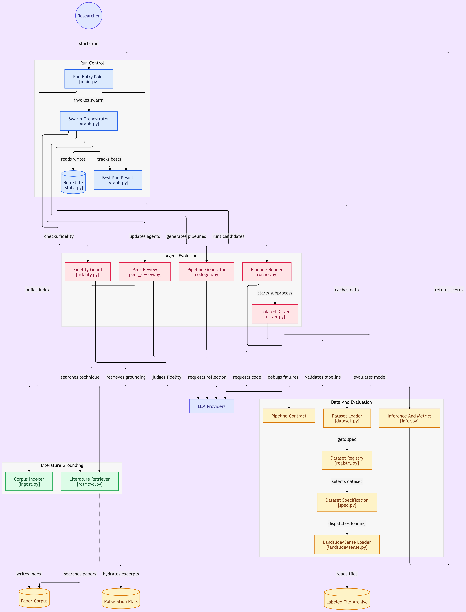

# AutoLSM-Swarm

A swarm of LLM agents that search the landslide-mapping literature and evolve their own
landslide detection/segmentation pipelines, adapting the particle-swarm skill-evolution
framework **AgentPSO** (Hwang et al., 2026) from general LLM reasoning to a concrete
Earth-observation task: mapping landslides from satellite imagery.

Hundreds of landslide-mapping methods have been published, no single one generalizes
across regions/sensors, and reproducing them one at a time to find the best combination
for a given dataset does not scale — only ~20% of papers on the topic even release code
(see the corpus survey below). Instead of a human replicating papers sequentially, a
population of agents searches the published methodology space in parallel, each
converging on its own pipeline while learning from its peers' results.



## Methodology

Each agent is a "particle" whose **position is its `pipeline.py`** — the single artifact
it owns and the thing that is scored. There is no separate natural-language strategy
document to keep in sync with the code: the score is optimized on the code itself. The
velocity is still natural-language text, as in AgentPSO. Every round
follows a five-step loop
([`src/orchestration/graph.py`](src/orchestration/graph.py),
[`src/orchestration/peer_review.py`](src/orchestration/peer_review.py)); all prompts live
in one file, [`src/prompts.yaml`](src/prompts.yaml):

1. **Independent solving.** Every agent runs its current `pipeline.py`
   (preprocess → build/train a model → predict) against the fixed train/val split, once
   per evaluation seed (`eval_seeds` in `src/config.py`, up to `--n-seeds N` of them). A
   pipeline's score is its **mean Dice over those seeds**; the per-seed Dice and their
   spread are recorded too.
2. **Peer review** (LLM call *A*, one per round, shared by the swarm). Every agent's
   predictions on the same validation tiles are turned, by deterministic code
   ([`src/eval/observe.py`](src/eval/observe.py)), into text tables of how each pipeline
   *behaves*: precision/recall, over- vs under-segmentation, tile-level detection and
   false-alarm tiles, object-level recall and fragmentation, performance by landslide
   size, complementarity between agents, and Dice across seeds. The peer-review LLM writes
   a comparative report on those tables (the exact tables are always passed along with it,
   so a misquoted number can be checked). Peers' *code* is never part of it — as in
   AgentPSO, where peers' skills are excluded — so an agent has to infer *why* something
   works instead of copying it.
3. **Reflect** (LLM call *B*, per agent). From nothing but its own `pipeline.py` and this
   round's peer review, the agent works out how its pipeline should improve given how its
   behavior compares with its peers'. Optionally (`enriched_reflection_all`,
   `random_enriched_reflection`, or automatically for the current global-best holder), the
   reflection closes with one explicit `GROUNDING QUERY: ...` line that is used,
   unmodified, as a corpus search query, and a second pass (`GroundReflection`) revises the
   reflection against the retrieved papers, citing a specific technique (`[paper_id]`)
   where one actually bears on it.
4. **Velocity update** (LLM call *C*, per agent). Merges the grounded reflection with the
   previous velocity, the recent trajectory (past velocities and the Dice each one
   produced), the agent's own personal-best pipeline and the swarm's global-best pipeline
   into one directive: with the default prompts a single `CHANGE <HPARAMS key>: old -> new`
   or one structural mechanism; with the multi-change prompts (see "Prompt variants") a
   coherent set of them. How many changes a velocity may hold is decided by the prompts, not
   the code. Then **call *D*** turns the current `pipeline.py` and that velocity into the next
   `pipeline.py`, changing nothing the velocity does not name. Every pipeline declares its tunables in a module-level `HPARAMS` dict, so a
   parametric change is exact and the size of every move is measurable
   (`changed_lines`, `hparams_changed` in the ledger).
   **Optional fidelity gate** (`fidelity_check` in `src/config.py`, on by default). Right
   after call *D*, a judge LLM ([`src/agents/fidelity.py`](src/agents/fidelity.py)) reads the
   velocity, the diff from the previous to the updated `pipeline.py`, and the updated code,
   and decides whether the chosen change was applied correctly and nothing else changed (its
   prompts describe the one-change rule, so leave the gate off with the multi-change prompts). A
   `NOT_FAITHFUL` verdict sends the update back to the code LLM to redo, up to
   `max_fidelity_iters` times; while redoing it, the code LLM may use Tavily web search
   (`fidelity_web_search`, needs `TAVILY_API_KEY`) to look up the exact formula of a named
   technique. If it is still flagged after the last revision, `run_unfaithful_pipeline`
   decides: `True` (default) runs the latest attempt as it is; `False` rejects the update and
   the agent's previous `pipeline.py` is re-run and re-scored instead. Either way the ledger
   marks `fidelity_faithful: false`. The gate judges velocity
   applications only (not round-0 pipelines or crash fixes), and each check is logged in
   `fidelity.md` next to the pipeline.
5. **Validation-based best tracking.** A new pipeline only replaces an agent's
   personal-best (or the swarm's global-best) if its mean Dice improves on the previous
   best by more than a margin `p_best_epsilon`, damping noisy fluctuations.

Round 0 has no peers to review: each agent retrieves papers from the literature corpus
(by default sharded so agents do not all see the same top-k; `retrieval_strategy` also offers
`mmr` and `cluster`, see below) and writes its first `pipeline.py` directly from them. With
`use_rag=false` there is no retrieval at all: round 0 is written from the dataset description
alone and later rounds never run an enriched reflection (the no-literature baseline).

This project uses a **global-best (fully-connected) topology**: every agent is steered
toward one swarm-wide best pipeline each round. Training stops after `n_rounds`, or earlier
if the global-best Dice has not improved for `plateau_patience` consecutive rounds.

Generated pipelines must satisfy a fixed contract
([`src/agents/pipeline_contract.py`](src/agents/pipeline_contract.py)) —
`preprocess(X) -> X`, `build_model(config) -> model`, `train(model, X, y) -> model`,
a `.predict(X)` returning binary masks, and a JSON-serializable `HPARAMS` dict — which is
smoke-tested on a handful of fixed tiles before a pipeline is trusted to run on the full
split. If a pipeline crashes (under any seed) or violates the contract, its traceback is
fed back to the LLM in a bounded generate/debug loop (`max_debug_iters`) before the round
gives up on it
([`src/agents/runner.py`](src/agents/runner.py)).

## Dataset

By default, pipelines are trained and scored on the **Landslide4Sense** benchmark
(Ghorbanzadeh et al., 2022): 128×128 multispectral + DEM-derived tiles (14 channels)
with binary landslide masks, expected under `archive/` as `archive/img/image_N.h5` and
`archive/mask/mask_N.h5` (only the originally labeled `TrainData` tiles). A fixed, seeded
train/val/test split (`split_ratios` in [`src/config.py`](src/config.py), default 70/15/15)
is carved out of these tiles and reused across every run.

The dataset layer is dataset-agnostic by design: everything specific to Landslide4Sense
(its description text, array shapes/channels, file layout, and loading code) lives
behind a single `DatasetSpec`
([`src/data/spec.py`](src/data/spec.py),
[`src/data/datasets/landslide4sense.py`](src/data/datasets/landslide4sense.py)), looked
up by `settings.dataset_name` via a registry
([`src/data/registry.py`](src/data/registry.py)). Every LLM-facing description of the
dataset (`DATASET_DESCRIPTION`, the pipeline contract's array-shape doc-string,
reflection prompts, retrieval query) and the actual loading code
([`src/data/dataset.py`](src/data/dataset.py)) are all derived from that one spec —
switching datasets never means editing prompts or loader code by hand.

### Adding a new dataset

1. Create `src/data/datasets/<name>.py` implementing:
   - `load_split(split, dataset_dir, max_tiles=None) -> (X, y, ids)` — loads one of
     `"train"/"val"/"test"` as stacked arrays. If your dataset is indexed by id (like
     Landslide4Sense's tile ids), reuse
     [`split_ids_by_ratio`](src/data/dataset.py) from `data.dataset` for the
     seeded train/val/test cut instead of reimplementing it.
   - `load_smoke_sample(dataset_dir, ids) -> (X, y)` — loads a handful of specific
     samples by id, used for the cheap pre-flight smoke test.
   - A `DESCRIPTION` string: free-text prose for the LLM covering tile/scene size,
     channel count and semantics, whether the data is multi-temporal, and label
     semantics — this is what an agent actually sees when deciding its strategy.
   - A module-level `SPEC = DatasetSpec(...)` (see
     [`src/data/spec.py`](src/data/spec.py)) wiring up `name`, `description`,
     `input_shape_doc`/`label_shape_doc` (short shape annotations spliced into the
     pipeline contract, e.g. `"(N,H,W,C)"` or `"(N,T,H,W,C)"` for multi-temporal data),
     `smoke_tile_ids`, and the two loader functions above.
2. Hand-verify `smoke_tile_ids`: a few ids from the train split that include at least
   one positive (label present) and one negative sample — this is dataset-specific and
   must be re-checked for every new dataset, it does not carry over from
   Landslide4Sense's `[1, 4, 8, 10]`.
3. Register it in [`src/data/registry.py`](src/data/registry.py) (one line: add the
   module's `SPEC` to `_REGISTRY`).
4. Point `dataset_name` (in [`src/config.py`](src/config.py) or `.env`) at your
   dataset's `name`, and `dataset_dir` at where its files live on disk.

Nothing outside `src/data/` needs to change — `preprocess`/`build_model`/`train`'s
contract shapes and the pipeline/reflection prompts all pick up the new
dataset automatically through the spec.

## Literature corpus

Agents ground their pipelines in retrieved papers rather than generic knowledge — both
when a pipeline is first written (round 0) and, for the agents chosen for an enriched
reflection, in later rounds too (`GroundReflection`, see Methodology above). The corpus is a set of ~300 landslide-mapping papers, each pre-summarized
into a structured JSON (methods, datasets, reported novelty, reproducibility status)
and indexed into a local Chroma vector store for retrieval
([`src/corpus/ingest.py`](src/corpus/ingest.py),
[`src/corpus/retrieve.py`](src/corpus/retrieve.py)). This corpus — including the
reproducibility survey mentioned above (only ~20% of 2020–2025 automated
landslide-mapping papers publish code) — is browsable at
**[fhrochaf.github.io/LSM_ReproViewer](https://fhrochaf.github.io/LSM_ReproViewer/)**.
Retrieved summaries are hydrated with an excerpt of each paper's actual full text on
demand (extracted once via `pypdf`, then disk-cached —
[`src/corpus/pdf_extract.py`](src/corpus/pdf_extract.py)) before being stuffed into an
agent's prompt.

## Module overview

- [`main.py`](main.py) — CLI entry point; wires config, the RAG index, the cached
  dataset, and the round-loop graph together, then runs (or resumes) a swarm.
- [`src/config.py`](src/config.py) — the single `Settings` object (pydantic-settings,
  loaded from `.env`) every other module imports: LLM provider/model, swarm size,
  round/plateau/epsilon hyperparameters, `dataset_name`/`dataset_dir` and corpus paths,
  retrieval settings.
- **`src/agents/`** — everything about one agent's own write/run/debug cycle:
  - [`codegen.py`](src/agents/codegen.py) — LLM calls that write the round-0
    `pipeline.py` from retrieved papers, apply one velocity to a pipeline (call *D*), redo
    an update the fidelity judge flagged (optionally with Tavily web search), or fix a
    pipeline that crashed.
  - [`fidelity.py`](src/agents/fidelity.py) — the optional gate after call *D*: a judge LLM
    checks the updated `pipeline.py` against the velocity and sends `NOT_FAITHFUL` updates
    back to the code LLM, up to `max_fidelity_iters` times.
  - [`driver.py`](src/agents/driver.py) — standalone subprocess entry point that
    actually executes one `pipeline.py` end-to-end (preprocess → train → evaluate) under
    one seed (`AUTOLSM_SEED`) in isolation from the orchestrator, saving its validation
    predictions and auto-installing any library the agent imports.
  - [`runner.py`](src/agents/runner.py) — the per-agent loop: runs the pipeline under
    every evaluation seed and, on a crash under any of them, feeds the traceback back for
    a fix, up to `max_debug_iters`.
  - [`pipeline_contract.py`](src/agents/pipeline_contract.py) — the fixed interface
    every generated pipeline must implement (including `HPARAMS`), plus the smoke test
    that checks it cheaply before a full run.
  - [`prompts.py`](src/agents/prompts.py) — loads the prompts YAML (default
    [`src/prompts.yaml`](src/prompts.yaml)), the one file holding every prompt of a run, and
    renders its `<<placeholders>>`. Which file is read is `prompts_file` in `src/config.py`
    (see "Prompt variants" below); it is validated at start-up.
  - [`artifacts.py`](src/agents/artifacts.py) — per-run/round/agent file I/O
    (`<runs_dir>/<run_id>/round_<t>/agent_<i>/{pipeline.py,reflection.md,velocity.md,...}`).
  - [`text_utils.py`](src/agents/text_utils.py) — small helpers for cleaning LLM output
    (stripping code fences, extracting code blocks).
- **`src/corpus/`** — the literature RAG layer:
  - [`ingest.py`](src/corpus/ingest.py) — builds the persisted Chroma index from the
    per-paper JSON summaries.
  - [`retrieve.py`](src/corpus/retrieve.py) — similarity search over that index, plus
    `retrieve_diverse`, which hands round-0 agents different papers so they don't all
    ground themselves in the same top-k. `retrieval_strategy` (config.py / `RETRIEVAL_STRATEGY`)
    picks how: `shard` (default: one shared candidate pool dealt out round-robin), `mmr`
    (maximal-marginal-relevance picks from a `retrieval_pool_size` pool, dealt out round-robin),
    or `cluster` (k-means groups of that pool, one group per agent).
  - [`pdf_extract.py`](src/corpus/pdf_extract.py) — on-demand full-text PDF extraction
    and disk caching, keyed by paper id.
- **`src/data/`** — dataset-agnostic loading, dispatched by `settings.dataset_name`
  (see Dataset above):
  - [`spec.py`](src/data/spec.py) — the `DatasetSpec` dataclass every dataset module
    builds: description text, contract shape doc-strings, smoke-test ids, and loader
    functions.
  - [`registry.py`](src/data/registry.py) — `get_dataset_spec(name)`, the name → spec
    lookup every other module goes through.
  - [`datasets/landslide4sense.py`](src/data/datasets/landslide4sense.py) — the
    Landslide4Sense `DatasetSpec`: its description, h5py-based tile loading, and
    hand-verified smoke-test ids. Template for adding another dataset.
  - [`dataset.py`](src/data/dataset.py) — the generic entry points (`load_split`,
    `load_smoke_sample`, `build_data_cache`) that dispatch to the active spec, plus
    `split_ids_by_ratio`, the seeded train/val/test split logic shared by any
    id-indexed dataset. Also builds the per-run `.npz` cache so the dataset is read
    from disk only once per run.
- **`src/eval/`** — the fixed scoring contract agents cannot override:
  - [`metrics.py`](src/eval/metrics.py) — pure Dice/IoU implementations.
  - [`observe.py`](src/eval/observe.py) — the deterministic behavioral comparison of all
    agents' predictions (precision/recall, tile- and object-level detection, size strata,
    complementarity, Dice across seeds), formatted as the text tables the peer review
    is built from.
  - [`infer.py`](src/eval/infer.py) — runs an agent's `preprocess`/`predict` and scores
    the result against ground truth.
- **`src/orchestration/`** — the swarm loop itself:
  - [`state.py`](src/orchestration/state.py) — `AgentState`/`SwarmState`: particle-style
    bookkeeping (pipeline, velocity, personal-best, global-best).
  - [`peer_review.py`](src/orchestration/peer_review.py) — the swarm-wide peer review
    (call *A*) and the per-agent `Reflect → (GroundReflection) → VelocityUpdate` chain
    described above, plus the hand-off to `apply_velocity` (call *D*).
  - [`registry.py`](src/orchestration/registry.py) — the cross-run results registry
    (see Usage).
  - [`graph.py`](src/orchestration/graph.py) — the round loop as a LangGraph
    `StateGraph`: retrieval + initial pipelines at round 0, peer review + pipeline
    updates in later rounds, personal-/global-best tracking, plateau-based early
    stopping, and per-agent checkpointing (`state_snapshot.json`, updated as each agent
    finishes so an interrupted round can resume without rerunning agents already done)
    for `--resume`. At the end of a run it registers the result.

## Setup

```bash
uv sync
```

The swarm uses up to three independently-configured LLMs
([`src/config.py`](src/config.py)), each free to be a different provider/model:

| Role | Settings | Used for |
|---|---|---|
| Primary | `llm_provider` / `model_name` | the per-agent reflection chain (`Reflect → GroundReflection → VelocityUpdate`) |
| Peer review / judge | `llm_provider_2` / `model_name_2` | the once-per-round peer-review report on the code-computed metric tables, and the optional fidelity judge that checks each updated `pipeline.py` against its velocity — deliberately cheap/small, since both are narrow read-and-judge tasks |
| Code | `llm_provider_3` / `model_name_3` | writing the round-0 `pipeline.py`, applying velocities to it, redoing updates the judge flagged, and fixing crashes (`agents/codegen.py`) |

Add the required API key(s) to a `.env` file at the repo root — one per distinct
provider used above (e.g. `ANTHROPIC_API_KEY`, `GOOGLE_GENAI_API_KEY`); if two roles
share a provider they share its key. `corpus_json_dir` and `publications_dir` in the
same file point at the literature corpus's JSON summaries and source PDFs on disk —
update them to wherever your copy of the corpus lives.

## Usage

```bash
python main.py [--agents N] [--rounds T] [--max-train-tiles N] [--n-seeds N]
                [--plateau-patience N] [--rebuild-index] [--resume RUN_ID]
```

| Flag | Description |
|---|---|
| `--agents N` | Number of agents in the swarm (default from config: 2). Ignored with `--resume`. |
| `--rounds T` | Number of rounds to train for (default from config: 2). Required alongside `--resume`, where it is the target round to train up to. |
| `--max-train-tiles N` | Cap on labeled tiles used for training (a cheap-proxy subset). Ignored with `--resume` — data is reused from the original run. |
| `--n-seeds N` | Evaluate every pipeline under up to N of the seeds registered in `eval_seeds` (`src/config.py`, default `[42, 43, 44]`); its score is the mean Dice over them. Each seed is a full training run, so cost scales with N. |
| `--plateau-patience N` | Stop early after this many consecutive rounds with no global-best Dice improvement (default from config: 3). |
| `--rebuild-index` | Force a rebuild of the RAG literature index even if one already exists. |
| `--resume RUN_ID` | Keep training an existing run (`<runs_dir>/<RUN_ID>`) instead of starting a new one, reusing its cached dataset split and current swarm state. |

Each run writes to `<runs_dir>/<run_id>/` (`runs_dir` in
[`src/config.py`](src/config.py), default `runs_landslide4sense/`): per-round
`peer_review.md` / `peer_review_tables.md`, per-round, per-agent
`pipeline.py`/`reflection.md`/`velocity.md`/`velocity_reasoning.md`/`fidelity.md`/`driver_stdout.json` and per-seed validation
predictions, an append-only `ledger.jsonl` of every round's scores (per seed, with the
size of each change, the fidelity verdict and the behavior metrics), a `state_snapshot.json` checkpoint (used
by `--resume`), `g_best_pipeline.py`, and a final `summary.json`.

### Prompt variants

Every prompt lives in one YAML file, and `prompts_file` in [`src/config.py`](src/config.py)
says which one a run reads: a name resolved under `src/` (default `prompts.yaml`), or a path.
Keep one file per variant and select it per run without touching code:

```bash
PROMPTS_FILE=prompts_velocity_update_cot.yaml python main.py --agents 5 --rounds 10
```

(or set `PROMPTS_FILE` in `.env`). The file is checked when the program starts, before any LLM call
or training is paid for. Only two things stop a run, each with the file name and the problem:
a file that does not exist, and a prompt that an enabled feature needs but the file lacks
(there is nothing to send). Placeholders never stop a run: a prompt may leave them out (e.g.
drop the trajectory from the velocity prompt) and they are just not shown, while one the code
does not supply (a typo, or one from another version of the prompts) gets a warning and is
left as written in the text.
The fidelity and enrichment prompts are only required when those features are switched on.
Each run stores the file it used as `<run>/prompts_used.yaml`, and the registry records its
name and a short hash (`prompts_file`, `prompts_sha`), so results can be traced to the exact
prompt text; `--resume` warns if the file changed since the run started.

### Ablation: no literature, single agent

`use_rag=false` (config / `USE_RAG`) switches corpus retrieval off. The round-0 prompt becomes
`pipeline.initial_user_no_rag`, which only the prompt files meant for this mode define; with
`use_rag=false` a file lacking it is rejected at startup, and the retrieval and enrichment prompts
are no longer required. [`src/prompts_singleagent_noRag.yaml`](src/prompts_singleagent_noRag.yaml)
is that variant for one agent: it also drops every mention of peers, a swarm and a global best, so
the agent only sees its own behavior report and its own best pipeline. A baseline run is
`USE_RAG=false PROMPTS_FILE=prompts_singleagent_noRag.yaml python main.py --agents 1 --rounds 10`.
`use_rag` is recorded in the registry next to `retrieval_strategy`, `retrieval_k`,
`retrieval_pool_size`, `mmr_lambda` and `retrieval_filter`.

### Metadata filter on retrieval

At index time ([`src/corpus/ingest.py`](src/corpus/ingest.py)) each paper JSON is joined, on its
filename stem == the CSV's `EID`, to the Scopus-export CSV at `corpus_metadata_csv` (config.py;
`;`-delimited; `None` skips the join), adding `method_class_name`, `year`, `cited_by`,
`source_title` and `document_type` to the metadata already stored (`paper_id`,
`reproducibility_status`, `n_methods`, `n_datasets`). Unmatched or blank values become `"UNKNOWN"`
(text) or `0` (numbers). `retrieval_filter` (config / `RETRIEVAL_FILTER` as JSON) is a Chroma
`where` dict applied to every corpus retrieval — round 0 under all three strategies and the enriched
reflection; `None` searches the whole corpus. E.g. `{"method_class_name": "CNN-based Semantic
Segmentation"}` or `{"$and": [{"year": {"$gte": 2022}}, {"reproducibility_status": "REPRODUCIBLE"}]}`.
Changing the CSV or its path needs `--rebuild-index` (which now drops the old collection first
instead of appending duplicates); changing only the filter does not. A filter matching fewer than
`retrieval_k × n_agents` papers gives agents fewer papers, and one matching none will fail.

### Round-0 retrieval strategies

`retrieval_strategy` (config / `RETRIEVAL_STRATEGY`) controls how round-0 papers are handed to the
agents ([`src/corpus/retrieve.py`](src/corpus/retrieve.py)): `shard` (default) deals the top
`retrieval_k × n_agents` papers round-robin; `mmr` picks them by maximal marginal relevance over a
`retrieval_pool_size` pool (`mmr_lambda` trades relevance against diversity) and deals them out the
same way; `cluster` k-means-clusters that pool on the stored embeddings into one group per agent and
gives each agent the top papers of its group. The prompts do not change between strategies.

### Results notebooks

`runs_pipeline_optimization/` holds finished runs and their analysis notebooks. The single-agent
notebooks read every run folder next to them and plot the runs on shared axes with the mean across
runs; they also include the behavior metrics recomputed over all saved evaluation seeds (cached as
`metrics_allseeds.csv` in each run folder, needs the validation labels once) and, for RAG-seeded
runs, a section on which papers seeded and enriched each run.

**Structured answers, independent of the prompt.** Two calls produce an answer the code has to
read one part of, so the code fixes their shape instead of relying on prompt wording
([`src/agents/structured.py`](src/agents/structured.py)): the velocity update is always
requested as JSON with the fields `reasoning` and `final_velocity`, and the fidelity judge
with `violations` and `verdict` (`FAITHFUL` / `NOT_FAITHFUL`). `final_velocity` is the velocity: the
directive the code LLM applies, the fidelity judge checks, and the trajectory records. The
`reasoning` is saved in `velocity_reasoning.md` and given to the code LLM as context (in the
update call and when it redoes a flagged one, via `<<velocity_reasoning>>` in those prompts), but
it is deliberately hidden from the fidelity judge, which must judge the directive on its own. The schema is sent with the request through the provider's native
structured output; if that is unavailable, the code asks for the same JSON in plain text, and
as a last resort uses the raw reply as the velocity (and honors a trailing `VERDICT:` line from
the judge). So any prompt file works, even one that says nothing about JSON; the prompts only
have to explain what belongs in each field.

[`src/prompts_velocity_cot_multichanges.yaml`](src/prompts_velocity_cot_multichanges.yaml) is the
chain-of-thought variant below with the one-change limit taken out of the velocity, apply and
reflect prompts: the velocity may list several changes (structural and parametric, in any mix) when
they serve the same weakness or need each other, and the update applies all of them. Nothing in
the code assumes a count: every change shows up in the ledger (`hparams_changed` lists every
`HPARAMS` value that moved, `changed_lines` the size of the edit). Its judge prompts are unchanged
and still describe one change, so run it with `fidelity_check = False`.

[`src/prompts_velocity_update_cot.yaml`](src/prompts_velocity_update_cot.yaml) is the default
prompts with a **chain-of-thought velocity update**: the model is told to put numbered reasoning
(last move, diagnosis, 2–4 candidate changes, elimination, decision) in `reasoning` and only the
chosen directive in `final_velocity`.

Every finished run is also registered in `<runs_dir>/registry.jsonl` (and a flattened
`registry.csv`): one row per run with its configuration (models, agents, rounds, seeds,
enrichment settings, git commit), outcome (global-best Dice mean/std/per-seed, best agent
and round, stop reason) and per-round curves, so runs can be compared without opening
their folders — `orchestration.registry.load_registry(runs_dir)` returns it as a
DataFrame.

## License

GPL-3.0 — see [LICENSE.txt](LICENSE.txt).

## References

Hwang, H., Kim, J., Kim, C., Chang, H., & Ye, J. C. (2026). *AgentPSO: Evolving Agent
Reasoning Skill via Multi-agent Particle Swarm Optimization*. arXiv:2605.08704.
https://arxiv.org/abs/2605.08704v2
